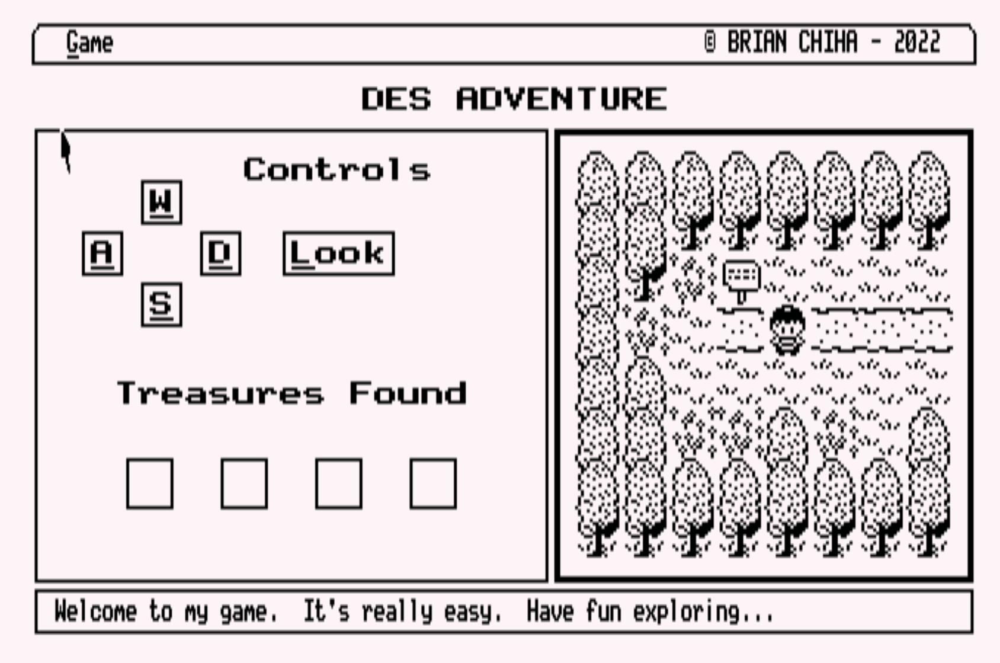
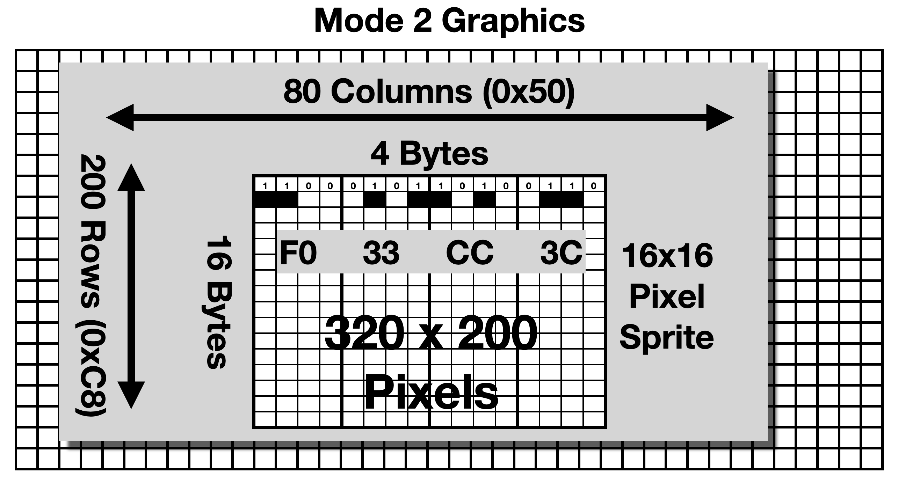
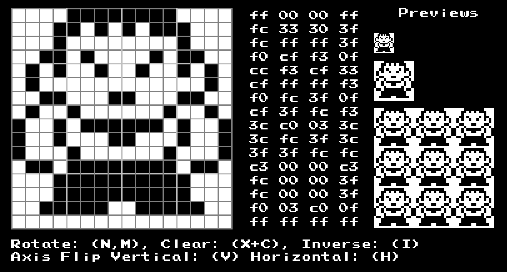
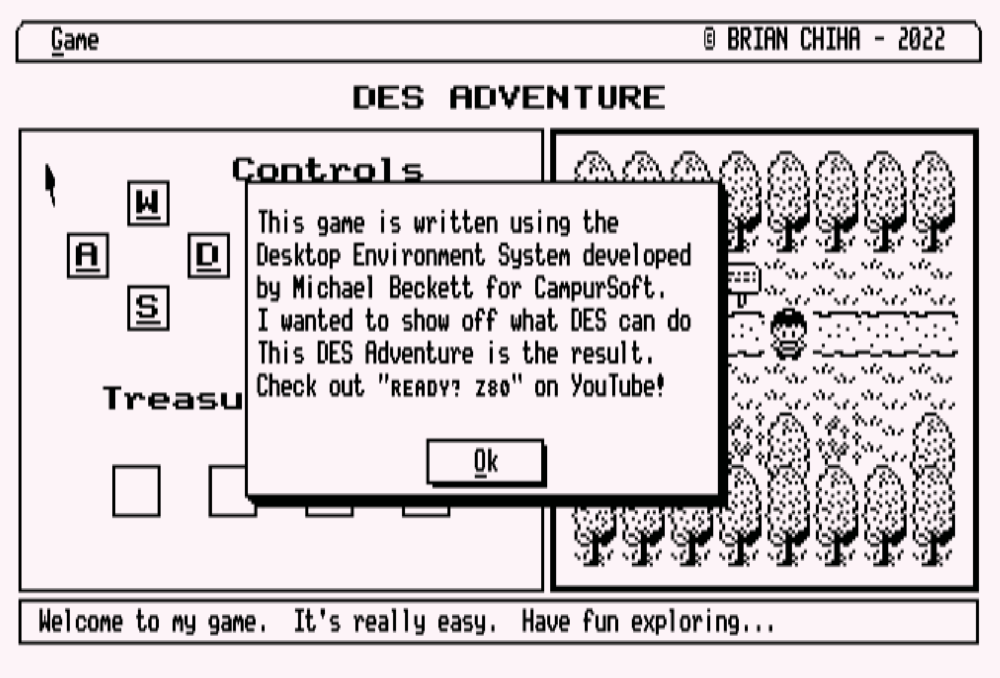
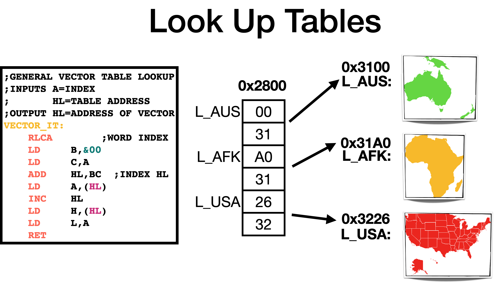

# DES Adventure <!-- omit in toc -->

## A game written for the Desktop Environment System (DES) on the Amstrad CPC <!-- omit in toc -->

Finally a Game for the Desktop Environment System!  Okay, this game is a Proof of Concept.  Nothing special but it could get others to develop something bigger.



- [Background](#background)
- [Getting Started](#getting-started)
- [Playing the Game](#playing-the-game)
- [Making your own Game](#making-your-own-game)
  - [The Screen](#the-screen)
  - [Click Zones](#click-zones)
  - [Pop Up Windows or Moving Sprites](#pop-up-windows-or-moving-sprites)
  - [Lookup tables](#lookup-tables)
  - [Mouse Inputs](#mouse-inputs)
- [Acknowledgments](#acknowledgments)
## Background

I was trawling the CPC archives when I stumbled on [DES](https://www.cpcwiki.eu/index.php?title=Desktop_Environment_System) written by Michael Beckett for CampurSoft.  I found a Development document that allows entry into the DES graphical routines.  I also noticed that only a few applications were ever made.  I set about developing a game and this is the result.

This small guide will go through the basics of getting started on programming applications on DES

## Getting Started

You would need an Amstrad CPC with the DES Roms installed.  This could be on a Software Emulator or the real computer using a ROM expansion board.  Here are some useful links:
-  [Desktop Environment System Software](https://www.cpcwiki.eu/index.php?title=Desktop_Environment_System). Roms, Software and Manuals are all here.
-  [MAXAM](https://www.cpcwiki.eu/index.php/MAXAM) Z80 Assembler.  I used this assembler.  It compiled a recognised binary for DES.
-  [Retro Virtual Machine](http://www.retrovirtualmachine.org/).  My goto Amstrad Emulator which has X-Mem expansions to easily install ROM images.
-  [Revaldinho's Rom Board](https://github.com/revaldinho/cpc_ram_expansion).  Hardware ROM expansion board.  Plug it into the back of your Amstrad CPC just like in the '80s
-  [16 x 16 Sprite Designer](https://slartibartfastbb.itch.io/amstrad-mode-2-sprite-designer). A utility that I created to help with 16x16 Sprites.  It outputs the 4 by 16 Byte values needed for the `DRAWICON` routine.

I was going to create a "Let's Code" series on my [Youtube Channel](https://www.youtube.com/c/ReadyZ80), that goes through step by step the making of this game, but... I felt I was going too slow and it will be a bit boring.  But here is the intro that I recorded.  It goes through set-up and compilation.

[Video](https://youtu.be/5ojtvTn5v2U) <-- Intro video

## Playing the Game

Just insert the [DSK](DES_Adventure.dsk), into an Amstrad running DES and click on 'ADVENT'.  Use the arrow to move, or just 'WSAD' and 'L' for Look.

**Warning**: This game wont win any competitions!.  I wrote the game in about 3 days during `Isolation`. It has basic movement, map/sprite drawing and finding stuff.  Hopefully, someone out there can improve from this design and do something awesome... 

## Making your own Game

The best way to start making your program is to look at the [code](code/ADVENT.ASM) of the game.  A bit of Z80 knowledge is needed but its got through simple blocks.  To move the player, I first check what is ahead, if its a space to move into, then I restore the previous space, and draw the player on the new space.  And if the next space is off the map, I draw the new map and reset the players spot.  Nothing tricky.

I've created a [DES Jumpblock name file](code/DESJBLK.ASM) to help reference DES routines by using their real name. IE: `CALL BUTTON` instead of `CALL &924B`.

The [Development Manual](resources/DES_Programming.pdf) is pretty good.  Just load the correct data to the registers, and call the routine.

Some things to note are:
### The Screen
DES uses Mode 2 Graphics and only 2 colours.  The Screen dimensions are 80 bytes across (X-Axis) and 200 bytes down (Y-Axis).  The X-Axis bytes use the Bits of each Byte for colour selection.  A standard 'full' pixel is two bits.  Group the 8-bits into pairs, (bits 7/6, 5/4, 3/2 and 1/0).  And when setting those bits, set the pair groupings to the same value.  



To display the pixels on the first row above, the four bytes across will be `F0, 33, CC and 3C`.  `3C` in binary is `00111100`. 

On the map, I use 16x16 pixel sprites.  This makes it easy to use the `CALL DRAWICON` routine.  Designing these sprites could be difficult to do manually.  So.. I created a program to help with this.  



It is freely available [online](https://slartibartfastbb.itch.io/amstrad-mode-2-sprite-designer).  The output on the right is the 4 bytes across and 16 down needed for the `DRAWICON` DES routine.

### Click Zones

These are areas on the screen where when the mouse is clicked (space bar), and the mouse is within a zone area, `CALL MOUSE` will return the zone number.  From here, you can determine what to do.  A simple way to set this up is using the `RamZones` function.  By placing the coordinates of the zones in a list.

The accompany click zones with key presses, another routine is needed.  Use `ZoneKeys`, same deal.  Supply a list of click zone numbers and the associated `Amstrad` internal key number.  See the Amstrad CPC manual to find out what key maps to what number.

When creating Buttons, a Click Zone will automatically be added.  There doesn't seem to be a nice way to remove this zone.  Let's say the button is part of a pop-up window.  What I did, was to put Click Zone creation in a Routine that I would call to re-initialise the zones, if the zones got messed up.

### Pop Up Windows or Moving Sprites

You are probably familiar with pop-up windows on your current OS.  DES has these, well not really.  Consider the screen as a 2D canvas.  If something is drawn over an existing drawing, then it's gone forever.  Unless that is, you have saved the screen underneath the pop up before writing displaying the pop up.  

Two routines handle this.  `StoreBox` and `RestoreBox`.  If you would like to place a message window on top of the current screen.  Like an info box, then before displaying that box, use the `StoreBox` to save the screen portion to memory.  Once the pop-up is closed, by clicking a button. Use `RestoreBox` to redraw the previous portion of the screen.  

I use these for my About, and Information Dialogs.  Also, when moving the player on the map.  Before I move into a square, I save the square that the player will walk into.  Once the player moves from that position, I restore the map where the player was previously.  Its fast and works well.



Lastly, I found an **error**, in the documentation.  the `RestoreBox` routine, the Entry address for the buffer should be `DE` and not `BC`.  Just look at what I do in the code.

### Lookup tables

Lookup Tables or Vector tables are a standard way the reference data on the Z80.  I use them often in my code.  Let's say you would like to find map number `13`.  Where is this map stored in memory?  Just place all the maps starting addresses sequentially in the table. Then use an index of `13` to point `HL` to the start of the actual map.



In this example, I have three maps, Australia, Africa and the USA.  They are in some random location in memory.  I then put their start addresses in a sequential table from `0x2800`.  This also could be anywhere in memory.  

To get `HL` point the correct map, I use the `VECTOR_IT` routine.  Pass in an Index in Register `A` and the base address of the lookup table in `HL`.  The routine will return `HL` with the actual start of the map address.

There are quicker ways to do this if the vector table is __aligned__.

### Mouse Inputs

The DES Mouse pointer works like the typical mouse pointers you have used in the past.  Use the arrow keys, joystick or AMX Mouse to control the pointer.  When, Space/Button A is pressed.  It registers a click.  The Spacebar or Joystick Button could be held down _indefinitely_.  A neat way to handle this is to surround the MOUSE call with WAITS.  Just like so

```
    CALL   WAIT  ;Waits until all mouse select keys are released 
    CALL   MOUSE ;Waits for user to select using pointer
    CALL   WAIT  ;Waits until all mouse select keys are released 
```

As the MOUSE routine is the only way to register keyboard/mouse inputs it needs to be placed somewhere in a routine that is continually checked.  The downside is that the MOUSE routine _waits_ for an input.  I initially wanted to make a SNAKE game, but there was no way to move the snake in the background while the MOUSE was polled.  Hence why the game is a _turn_ based game.

There is a provided routine called `MOUSEPOS` which claims to poll the mouse and return a click if any was done.  But this routine crashed the game.  Oh well. I didn't have time to investigate.

## Acknowledgments

I had Peter Campbell, the Campursoft Business Manager 'test' the game before it was published.  He commented that he couldn't stop grinning seeing a game written for DES.  He also could have been constipated.  Either way, it was great to get his blessing.

I used the sprites for the map from [bigindie](https://bigindie.itch.io/16x16-1-bit-rpg-forest-tile-set) on itch.io.  I tried to buy him a coffee, but it didn't work.....  

And if anyone knows the whereabouts of Michael Beckett, tell him he is a legend and that his program, DES is awesome.


